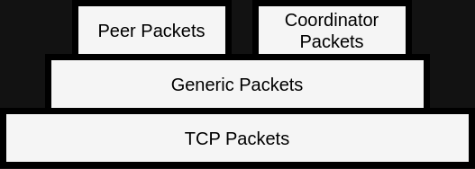
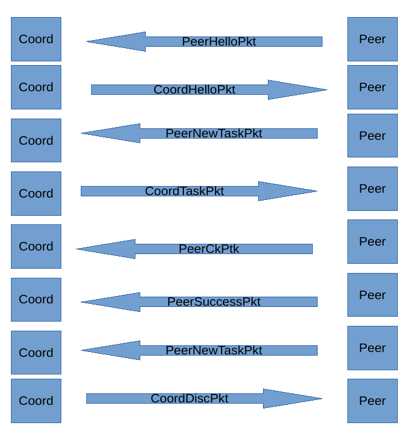
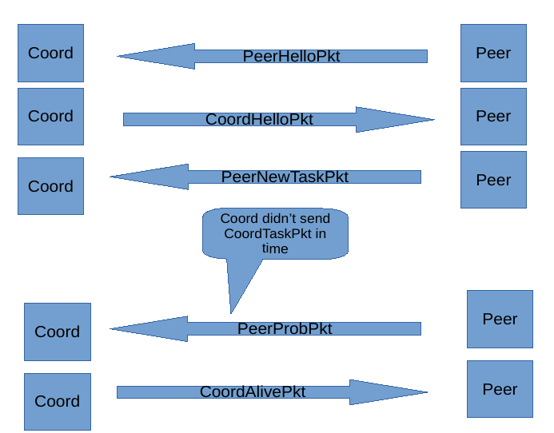
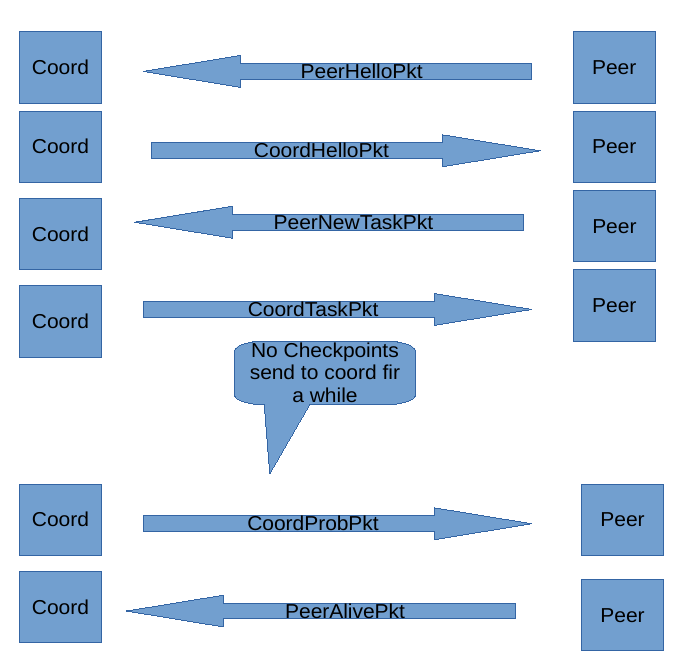
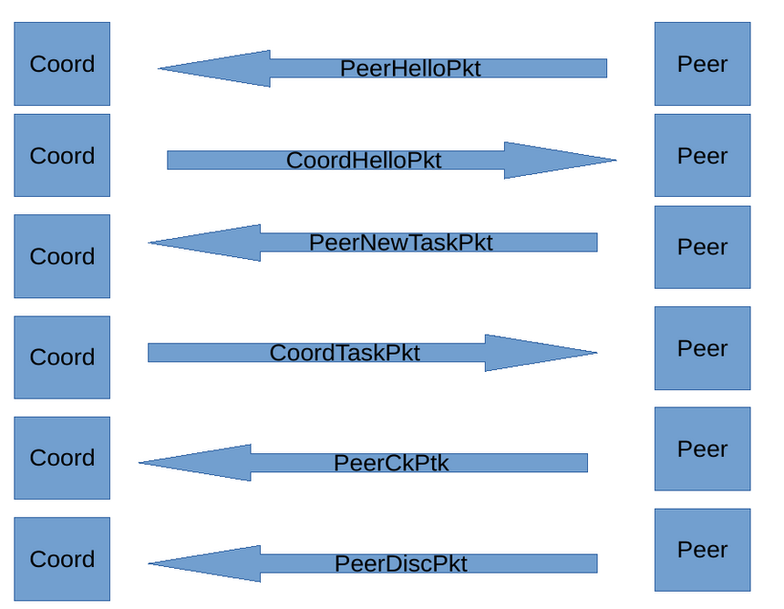
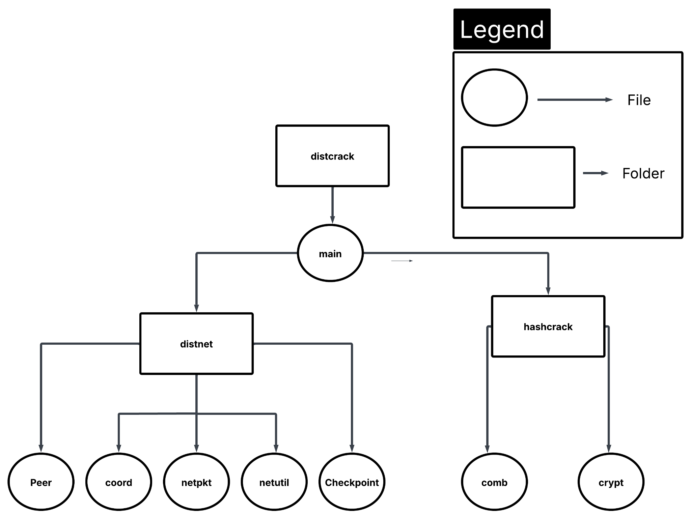

# distcrack
A distributed password hash cracker that distributes workload across participating node

## Purpose
This program is a distributed password hash cracker, which supports MD5, SHA256, SHA512, Bcrypt, and Yescrypt hashs. This program follows client-server architecture, where a coordinator, a.k.a, the server, assigns a list of passwords to hash to one or more peers, a.k.a, clients. The coordinator is responsible for accepting peer connections and assigning a list of passwords to be hashed to peers. On the other hand, peers are responsible for connecting to the coordinator, accepting a list of passwords to hash from the coordinator, and notifying the coordinator if a hashed password matches the actual password hash that is meant to be cracked. 

## Network Protocol Overview  
In this protocol, "client" and "server" of client-server architecture will be referred to as "peer" and "coordinator" respectively. So, coordinator is basically the server, and peer is the client. This protocol can work over any reliable network protocol such as TCP. And the term "job" refers to a set of password guesses given to a peer to try. The underlying reliable protocol chosen is TCP.  

There are two groups of packets in this protocol, the ones sent by the peer and the ones sent by the coordinator. Packets sent by the peer are intended to be received by the coordinator, and packets sent by the coordinator are intended to be received by the peer. Peer packets and Coordinator packets are enclosed within a a "generic" packet that is sent and received directly over TCP. This "generic" packet is called Generic packet since it is meant to enclose other packets. Peer packets and Coordinator packets are converted to binary and are nested within the Generic Packet. Considering UDP and TCP protocols as an analogy, Generic Packet is the IP packet that encloses the higher level UDP and TCP packets.

The following figure demonstrates the packet hierarchy: 

The following table lists and explains all packets involved: 
| Packet Name | Packet Description | 
|-------------|--------------------|
|GenPkt       |Generic Packet is the lower level packet that encloses all other high level packets and is the packet that is directly sent over TCP connection.|
| PeerHelloPkt | Packet a peer sends to initiate connection with the coordinator.|
| CoordHelloPkt | Packet coordinator sends back to acknowledge PeerHelloPkt. |
| PeerNewTaskPkt | Packet peer sends when asking for a new job. |
| CoordTaskPkt | Packet the coordinator sends in response to PeerNewTaskPkt that contains the job to be completed by the peer. |
| PeerCkPtk | Peer Checkpoint packet that a peer sends to update the coordinator regarding its progress. | 
| PeerSuccessPkt | Packet a peer sends if it successfully cracks the given password hash. | 
| CoordDiscPkt | Packet the coordinator sends when it has found the password and wishes to stop the peers. Or when the coordinator wants to terminate even when the password has not been found. |
| PeerProbPkt | Packet the peer sends to verify whether the coordinator is alive after a timeout. |
| CoordAlivePkt | Packet the coordinator sends in response to PeerProbPkt to tell the peer that it is indeed alive. | 
| CoordProbPkt | Packet the coordinator sends to verify whether a peer is alive after a timeout. | 
| PeerAlivePkt | Packet a peer sends in response to PeerProbPkt to tell the coordinator that it is indeed alive. | 
| PeerDiscPkt | Packet a peer sends when it wishes to gracefully terminate the connection. It contains the peer's progress up to this time. |

## Peer-Coordinator Interaction Scenarios
The following figures represent typical interaction scenarios between a peer and the coordinator.

The following figure demonstrates a successful interaction between the peer and the coordinator where the peer cracks the passwords: 

The following figure demonstrates the scenario where the peer timeouts waiting on the coordinator and sends a PeerProbPkt and coordinator responds back by sending a CoordAlivePkt:

The following figure demonstrates the scenario where the coordinator timeouts on the peer and sends a CoordProbPkt to which the peer responds by sending a PeerAlivePkt:

The following figure demonstrates the scenario where peer gracefully disconnects from the connection: 

## Data Types
### Packet Data
The following data types represent the packet types:
|Type Name | GenPkt |
|----------|--------|
| Type Description | Generic packet (or GenPkt for short) is a packet type that is meant to store other high level packets. |
| Type Attributes | (string PktType, string PayloadPktType, bytes PktBytes) PktType is set to Generic Packet. PayloadPktType is set to the name of the high level packet enclosed within this GenPkt. PktBytes stores the high-level packet in binary format. |

|Type Name | PeerHelloPkt |
|----------|--------------|
| PeerHelloPkt | Peer Hello Packet or PeerHelloPkt is the first packet sent by peer to coordinator in order to start the handshake between the coordinator and the peer. |
| Type Attributes | (string PktType, string IPv4, string IPv6, string MAC) PktType is set to "PeerHelloPkt". IPv4 is set to IPv4 address of the peer. IPv6 is optional and is set to IPv6 address of the peer. MAC is the MAC address of the peer. |

| Type Name | CoordHelloPkt |
|----------|--------------|
| Type Description | Packet the coordinator sends to acknowledge PeerHelloPkt sent by a peer. It contains a Session ID field that is a unique string used to identify the session between the coordinator and the peer. |
| Type Attributes | (string PktType, string SessionID, string Data) string is set to "CoordHelloPKt". SessionID is set to a unique string used to identify the session between the coordinator and the peer. Data is set to the password hash that is meant to be cracked. |

| Type Name | PeerCkPtk |
|----------|------------|
| Type Description | Peer Checkpoint Packet or PeerCkPtk is the packet peer sends to coordinator upon reaching the predefined checkpoint that is meant to update the coordinator regarding how far peer got though its assigned job. | 
| Type Attributes | (PktType, Checkpoint Ckpt, string SessionID) PktType is set to "PeerCkPkt". Ckpt is set to an instance of type Checkpoint that is meant to track progress made by a peer. SessionID is set to ession ID assigned to the session. |

| Type Name | PeerNewTaskPkt |
|----------|------------|
| Type Description | Peer New Task Packet or PeerNewTaskPkt is the packet a peer sends when it needs a new job. It is both sent at the beginning of the connection when the peer asks for its first job and also when the peer is done with its current job and wishes to work on another job. "job" means a set of passwords to crack. |
| Type Attributes | (string PktType, string SessionID) PktType is set to "PeerNewTaskPkt". SessionID is set to session ID assigned to the session. |

| Type Name | PeerDiscPkt | 
|-----------|-------------|
| Type Description | Peer Disconnect Packet or PeerDiscPkt is the packet a peer sends when it wishes to disconnect. It contains a checkpoint that stores the most recent breakthrough made by the peer. It is essentially a checkpoint packet that signals the end of the session. | 
| Type Attributes | (string PktType, Checkpoint Ckpt, string SessionID ) PktType is set to "PeerDiscPkt". Checkpoint represents how much work a peer has done. SessionID is set to session ID assigned to the session.

## Password Representation

A concise way of representing the range of password guesses was conceived in order to avoid flooding the network with long password strings. Instead of  sending a list of password strings, a set of integers is sent; this set of integers represent the passwords within a specific password list.

The foregoing integer set is as follows:
1. Inclusive starting index [of the password guesss set]
2. Last index tried [of the password guesss set]
3. Inclusive ending index [of the password guesss set]
4. Password length

For example, considering a password search space of only capital English alpabet letters A-Z, and given 
the maximum password length of 3 characters, tge following are three set of integers: 

Length one integer set: 
1. Inclusive Starting Index = 0 
2. Last Index tried  = -1
3. Inclusive Ending Index = 26^1 = 26

Length two integer set:
1. Inclusive Starting Index = 0 
2. Last Index tried  = -1
3. Inclusive Ending Index = 26^2 = 676 

Length three integer set:
1. Inclusive Starting Index = 0 
2. Last Index tried  = -1
3. Inclusive Ending Index = 26^3 = 17576 

For example, index 0 of length 1 set is  "A". And index 1 of length 2 sets is "AB" and so forth. 
"Last Index tried" integer is used for checkpointing purposes. When the first password in the range is tried it is incremented to 0 meaning that the password represented by index 0 has been tried. And it is incremented as other passwords within the range are tried until it reaches "Inclusive Ending Index" integer at which point the entire range of passwords has been attempted. 

