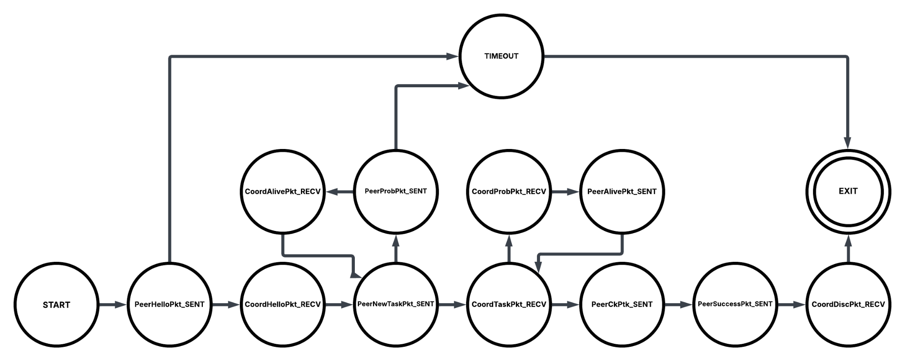

# distcrack
A distributed password hash cracker that distributes workload across participating node

### Purpose
This program is a distributed password hash cracker, which supports MD5, SHA256, SHA512, Bcrypt, and Yescrypt hashs. This program follows client-server architecture, where a coordinator, a.k.a, the server, assigns a list of passwords to hash to one or more peers, a.k.a, clients. The coordinator is responsible for accepting peer connections and assigning a list of passwords to be hashed to peers. On the other hand, peers are responsible for connecting to the coordinator, accepting a list of passwords to hash from the coordinator, and notifying the coordinator if a hashed password matches the actual password hash that is meant to be cracked. 

In addition, the purpose of this project was also to learn how distributed computing works under the hood. Concepts such as node coordination, job redistribution, job partitioning, checkpointing, probing, dynamic job assignment, and coordinator-peer architecture were learned and implemented in the project. 


### User Guide
#### Directory Structure 
```
/distcrack/
	go.mod	go.sum	main.go	distnet		hashcrack 
/distcrack/hashcrack/
	comb.go	crypt.go
/distcrack/distnet/
	checkpoint.go	coord.go	netpkt.go	netutil.go	peer.go
```

| **File/Directory Name**                   | **File/Directory Purpose**                                                                                   |
|------------------------------------------|--------------------------------------------------------------------------------------------------------------|
| `/disctrack/`                             | Parent directory of the project.                                                                             |
| `/disctrack/go.mod`                       | Go module file                                                                                               |
| `/disctrack/go.sum`                       | Go sum file                                                                                                   |
| `/disctrack/main.go`                      | The main program of the project.                                                                             |
| `/disctrack/hashcrack/`                   | Directory containing Go files related to password generation and password cracking.                          |
| `/disctrack/hashcrack/comb.go`           | Go file to generate all possible combinations of ASCII values for given lengths.                             |
| `/disctrack/hashcrack/crypt.go`          | Go file to hash a given string.                                                                              |
| `/disctrack/distnet/`                     | Directory containing files related to distributed computing.                                                 |
| `/disctrack/distnet/checkpoint.go`       | Go file that implements checkpointing.                                                                       |
| `/disctrack/distnet/coord.go`            | Go file that implements the coordinator.                                                                     |
| `/disctrack/distnet/netpkt.go`           | Go file that defines the custom packets of the protocol.                                                     |
| `/disctrack/distnet/netutil.go`          | Go file that defines functions needed to implement the distributed protocol such as packet send and receive. |
| `/disctrack/distnet/peer.go`             | Go file that implements the peer.                                                                            |


#### Compiling
```bash
cd ./distcrack
go build main.go
```

#### Running
Running a peer with the minimum number of command line arguments requires specifying server address and specifying that the program is meant to be run as a peer as follows:

```bash
./main.go -server=”192.168.0.2” -type=”peer”
```

Running the coordinator with the minimum number of command line arguments requires specifying the password hash to be cracked and the address server will be listening to. By default the program runs as the server and it listens to the localhost address. Run as follows: 

```bash
./main.go -server”192.168.0.2” -hash=’$1$0Ks5sWgj$eYvALz2Far8zFBbQ/XDQ01’
```

If you have enclosed the hash value in double quotes, and you get a shell error, use single quotes instead. 

#### Command Line Arguments and Flags
```
  -attempt int
    	Number of times connection can timeout after handshake before disconnecting. (default 10)
  -checkpoint int
    	How often to send a checkpoint. (default 1)
  -hash string
    	Hash to be decrypted (default " ")
  -maxlen int
    	Max length of password. (default 16)
  -port int
    	network port number (default 5000)
  -server string
    	IPv4 (default "127.0.0.1")
  -thread int
    	Number of threads to use. (default 8)
  -timeout int
    	Timeout in seconds (default 10)
  -type string
    	Type of code. Can be either coord or peer. (default "coord")
  -work-size int
    	Number of password attempts per job packet. (default 10000)

The command line arguments that are meant for the coordinator are the following:
-attempt int

checkpoint int

-hash string

-maxlen int

-port int

-server string

-timeout int

-work-size int

The command line arguments that are meant for a peer are the following:
-attempt int

-port int

-server string

-thread int

-timeout int

-type string // set to -type=”peer”
```

Note: If a command line argument corresponding to the coordinator is specified for a peer and vice versa, the command line argument is ignored by the program. 

#### Examples

The following is an example of running the coordinator:


The following is an example of running a peer:


### Network Protocol Overview  
In this protocol, "client" and "server" of client-server architecture will be referred to as "peer" and "coordinator" respectively. So, coordinator is basically the server, and peer is the client. This protocol can work over any reliable network protocol such as TCP. And the term "job" refers to a set of password guesses given to a peer to try. The underlying reliable protocol chosen is TCP.  

There are two groups of packets in this protocol, the ones sent by the peer and the ones sent by the coordinator. Packets sent by the peer are intended to be received by the coordinator, and packets sent by the coordinator are intended to be received by the peer. Peer packets and Coordinator packets are enclosed within a a "generic" packet that is sent and received directly over TCP. This "generic" packet is called Generic packet since it is meant to enclose other packets. Peer packets and Coordinator packets are converted to binary and are nested within the Generic Packet. Considering UDP and TCP protocols as an analogy, Generic Packet is the IP packet that encloses the higher level UDP and TCP packets.

The following figure demonstrates the packet hierarchy: 


The following table lists and explains all packets involved: 
| Packet Name | Packet Description | 
|-------------|--------------------|
|GenPkt       |Generic Packet is the lower level packet that encloses all other high level packets and is the packet that is directly sent over TCP connection.|
| PeerHelloPkt | Packet a peer sends to initiate connection with the coordinator.|
| CoordHelloPkt | Packet coordinator sends back to acknowledge PeerHelloPkt. |
| PeerNewTaskPkt | Packet peer sends when asking for a new job. |
| CoordTaskPkt | Packet the coordinator sends in response to PeerNewTaskPkt that contains the job to be completed by the peer. |
| PeerCkPtk | Peer Checkpoint packet that a peer sends to update the coordinator regarding its progress. | 
| PeerSuccessPkt | Packet a peer sends if it successfully cracks the given password hash. | 
| CoordDiscPkt | Packet the coordinator sends when it has found the password and wishes to stop the peers. Or when the coordinator wants to terminate even when the password has not been found. |
| PeerProbPkt | Packet the peer sends to verify whether the coordinator is alive after a timeout. |
| CoordAlivePkt | Packet the coordinator sends in response to PeerProbPkt to tell the peer that it is indeed alive. | 
| CoordProbPkt | Packet the coordinator sends to verify whether a peer is alive after a timeout. | 
| PeerAlivePkt | Packet a peer sends in response to PeerProbPkt to tell the coordinator that it is indeed alive. | 
| PeerDiscPkt | Packet a peer sends when it wishes to gracefully terminate the connection. It contains the peer's progress up to this time. |

### Peer-Coordinator Interaction Scenarios
The following figures represent typical interaction scenarios between a peer and the coordinator.

The following figure demonstrates a successful interaction between the peer and the coordinator where the peer cracks the passwords: 


The following figure demonstrates the scenario where the peer timeouts waiting on the coordinator and sends a PeerProbPkt and coordinator responds back by sending a CoordAlivePkt:


The following figure demonstrates the scenario where the coordinator timeouts on the peer and sends a CoordProbPkt to which the peer responds by sending a PeerAlivePkt:


The following figure demonstrates the scenario where peer gracefully disconnects from the connection: 


### Data Types
#### Packet Data
The following data types represent the packet types:
|Type Name | GenPkt |
|----------|--------|
| Type Description | Generic packet (or GenPkt for short) is a packet type that is meant to store other high level packets. |
| Type Attributes | (string PktType, string PayloadPktType, bytes PktBytes) PktType is set to Generic Packet. PayloadPktType is set to the name of the high level packet enclosed within this GenPkt. PktBytes stores the high-level packet in binary format. |

|Type Name | PeerHelloPkt |
|----------|--------------|
| PeerHelloPkt | Peer Hello Packet or PeerHelloPkt is the first packet sent by peer to coordinator in order to start the handshake between the coordinator and the peer. |
| Type Attributes | (string PktType, string IPv4, string IPv6, string MAC) PktType is set to "PeerHelloPkt". IPv4 is set to IPv4 address of the peer. IPv6 is optional and is set to IPv6 address of the peer. MAC is the MAC address of the peer. |


| Type Name | CoordHelloPkt |
|----------|--------------|
| Type Description | Packet the coordinator sends to acknowledge PeerHelloPkt sent by a peer. It contains a Session ID field that is a unique string used to identify the session between the coordinator and the peer. |
| Type Attributes | (string PktType, string SessionID, string Data) string is set to "CoordHelloPKt". SessionID is set to a unique string used to identify the session between the coordinator and the peer. Data is set to the password hash that is meant to be cracked. |


| Type Name | PeerCkPtk |
|----------|------------|
| Type Description | Peer Checkpoint Packet or PeerCkPtk is the packet peer sends to coordinator upon reaching the predefined checkpoint that is meant to update the coordinator regarding how far peer got though its assigned job. | 
| Type Attributes | (PktType, Checkpoint Ckpt, string SessionID) PktType is set to "PeerCkPkt". Ckpt is set to an instance of type Checkpoint that is meant to track progress made by a peer. SessionID is set to ession ID assigned to the session. |

| Type Name | PeerNewTaskPkt |
|----------|------------|
| Type Description | Peer New Task Packet or PeerNewTaskPkt is the packet a peer sends when it needs a new job. It is both sent at the beginning of the connection when the peer asks for its first job and also when the peer is done with its current job and wishes to work on another job. "job" means a set of passwords to crack. |
| Type Attributes | (string PktType, string SessionID) PktType is set to "PeerNewTaskPkt". SessionID is set to session ID assigned to the session. |

| Type Name | PeerDiscPkt | 
|-----------|-------------|
| Type Description | Peer Disconnect Packet or PeerDiscPkt is the packet a peer sends when it wishes to disconnect. It contains a checkpoint that stores the most recent breakthrough made by the peer. It is essentially a checkpoint packet that signals the end of the session. | 
| Type Attributes | (string PktType, Checkpoint Ckpt, string SessionID ) PktType is set to "PeerDiscPkt". Checkpoint represents how much work a peer has done. SessionID is set to session ID assigned to the session. | 


| **Type Name**      | `PeerSuccessPkt`                                                                 |
|--------------------|----------------------------------------------------------------------------------|
| **Type Description** | Peer Success Packet or `PeerSuccessPkt` is the packet peer sends when it successfully cracks the given password hash. |
| **Type Attributes** | - `string PktType` → Set to name of the type, here it is `"PeerSuccessPkt"`  <br> - `string SuccessVal` → Cracked password in this case.  <br> - `string SessionID` → Session ID assigned to the session. |


| **Type Name**      | `CoordDiscPkt`                                                                 |
|--------------------|--------------------------------------------------------------------------------|
| **Type Description** | Coordinator Disconnect Packet or `CoordDiscPkt` is the packet coordinator sends to peers when the password has been cracked. Whenever a peer sends a checkpoint or asks for another job, the coordinator sends this packet to tell the peer to terminate. |
| **Type Attributes** | - `string PktType` → Set to name of the type, here it is `"CoordDiscPkt"`  <br> - `string SessionID` → Session ID assigned to the session. |


| **Type Name**      | `CoordProbPkt`                                                                 |
|--------------------|--------------------------------------------------------------------------------|
| **Type Description** | Coordinator Probing Packet or `CoordProbPkt` is the packet coordinator sent when peer is still connected to the underlying TCP connection but has not been unresponsive. |
| **Type Attributes** | - `string PktType` → Set to name of the type, here it is `"CoordProbPkt"`  <br> - `string SessionID` → Session ID assigned to the session. |


| **Type Name**      | `PeerAlivePkt`                                                                 |
|--------------------|--------------------------------------------------------------------------------|
| **Type Description** | Peer Alive Packet or `PeerAlivePkt` is the packet sent by the peer in response to coordinator sending `CoordProbPkt` when coordinator is probing a peer to check whether the peer is alive or not. |
| **Type Attributes** | - `string PktType` → Set to name of the type, here it is `"PeerAlivePkt"`  <br> - `string SessionID` → Session ID assigned to the session. |


| **Type Name**      | `PeerProbPkt`                                                                 |
|--------------------|-------------------------------------------------------------------------------|
| **Type Description** | Peer Probing Packet is the packet peer sends to check whether the coordinator is alive or not. |
| **Type Attributes** | - `string PktType` → Set to name of the type, here it is `"PeerProbPkt"`  <br> - `string SessionID` → Session ID assigned to the session. |


| **Type Name**      | `CoordAlivePkt`                                                               |
|--------------------|--------------------------------------------------------------------------------|
| **Type Description** | Coordinator Alive Packet or `CoordAlivePkt` is the packet that coordinator sends in response to `PeerProbPkt` to tell the peer that it is alive. |
| **Type Attributes** | - `string PktType` → Set to name of the type, here it is `"CoordAlivePkt"`  <br> - `string SessionID` → Session ID assigned to the session. |


### Work Progress Data Types

The following are data types defined to handle checkpointing and work progress: 

| **Type Name**      | `WorkerInput`                                                                 |
|--------------------|--------------------------------------------------------------------------------|
| **Type Description** | `WorkerInput` is the work given to a worker thread that hashes password hashes and compares it against the real hash meant to be cracked. |
| **Type Attributes** | - `int Idx` → It is an index number used to keep track of a password guess such as `"123"` or `"ab"`.  <br> - `string Item` → It is the actual string representation of the password such as `"123"`. |


| **Type Name**      | `WorkerOutput`                                                                |
|--------------------|--------------------------------------------------------------------------------|
| **Type Description** | It is a data structure a worker thread produces in response to each `WorkerInput` instance given to it. It indicates whether the given password guess is indeed the **unhashed** password of the actual password hash. |
| **Type Attributes** | - `int Idx` → It is an index number used to keep track of a password guess such as `"123"` or `"ab"`.  <br> - `boolean Success` → Indicates whether the given password, represented by the password index `Idx`, is the cracked password. |


| **Type Name**      | `Checkpoint`                                                                  |
|--------------------|--------------------------------------------------------------------------------|
| **Type Description** | It is a data structure that tracks the progress of a job assigned to a peer. “Job” means a set of password guesses to try. |
| **Type Attributes** | - `integer InclusiveStartIdx` → First index of the given password length space permutation to try.  <br> - `integer InclusiveEndIdx` → Last index of the given password length space permutation to try.  <br> - `integer LatestCompletedIdx` → Most recent index of [`InclusiveStartIdx`, `InclusiveEndIdx`] range already tried.  <br> - `integer JobTypeID` → Length of the password. For example, `2` for `"12"` and `3` for `"123"`.  <br> - `integer list MajorPoints` → For each number in the `MajorPoints` list, when `LatestCompletedIdx` reaches that number, a checkpoint is due and must be sent to the coordinator.  <br> - `integer MajorPointIdx` → An index number that points to the latest checkpoint reached within the `MajorPoints` list. |


### Command Line Argument Data Types 
The following data types are filled with command line argument values specified by the user and given to the coordinator and the peer:

| **Type Name**      | `CoordParams`                                                                 |
|--------------------|--------------------------------------------------------------------------------|
| **Type Description** | Coordinator Parameters or `CoordParams` is a data type that holds the sanitized command line arguments meant to be given to the coordinator. |
| **Type Attributes** | - `integer TimeoutSeconds` → Number of seconds the coordinator waits on an unresponsive peer before it is considered a timeout.  <br> - `integer MaxTimeoutCounter` → Max number of timeouts that can occur in a row before the coordinator marks a peer as dead.  <br> - `string Data` → The real password hash to be cracked in this case.  <br> - `integer PartitionSize` → The number of password attempts assigned to each peer. May be lower if not enough guesses are left.  <br> - `integer InclusiveMaxPasswdLen` → Supposed maximum value of password length. For example, if 16 is specified, all passwords in the range [1, 16] are tried.  <br> - `string IPAddr` → IPv4 address that the server will be listening to.  <br> - `string Port` → Port number that the server will be listening to. |


| **Type Name**      | `PeerParams`                                                                  |
|--------------------|--------------------------------------------------------------------------------|
| **Type Description** | Peer Parameters or `CoordParams` is a data type that holds the sanitized command line arguments meant to be given to the coordinator. |
| **Type Attributes** | - `integer TimeoutSeconds` → Number of seconds peer waits on an unresponsive coordinator before it is considered a timeout.  <br> - `integer MaxTimeoutCounter` → Max number of timeouts that can occur in a row before peer marks the coordinator as dead.  <br> - `string IPAddr` → IPv4 address of the coordinator.  <br> - `string Port` → Port number of IPv4 where the coordinator is listening.  <br> - `integer ThreadNumber` → Number of worker threads to use. |


### Abstract Program Design
The following figure demonstrates the high level design of the program:  


The following table explains the purpose and responsibility of the functions shown in the preceding figure: 
| **Function Name**     | **Function Description**                                                                                                                                                                                                                                                                               |
|-----------------------|----------------------------------------------------------------------------------------------------------------------------------------------------------------------------------------------------------------------------------------------------------------------------------------------------------|
| `coordMiddleman()`    | `coordMiddleman()` is coordinator’s middleman function that is basically the “brain” of the coordinator. `coordMiddleman()` starts `handleCoordSend()` and `handleCoordRecv()` and uses `handleCoordRecv()` to receive incoming packets and `handleCoordSend()` to send outgoing packets. Note all three (`coordMiddleman()`, `handleCoordSend()`, and `handleCoordRecv()`) are run in separate threads and are operational until the end of the connection. If any of the three functions fails, the entire session fails. |
| `handleCoordSend()`   | `handleCoordSend()` handles packet send functionality of the coordinator. `coordMiddleman()` tells `handleCoordSend()` what packet to send at any given time.                                                                                                                                           |
| `handleCoordRecv()`   | `handleCoordRecv()` handles packet receive functionality of the coordinator. `handleCoordRecv()` notifies `coordMiddleman()` what kind of packet has been received and `coordMiddleman()` takes the necessary action based on the packet received.                                                     |
| `peerMiddleman()`     | `peerMiddleman()` is the `coordMiddleman()`'s equivalent of the peer.                                                                                                                                                                                                                                   |
| `handlePeerSend()`    | `handlePeerSend()` is the `handleCoordSend()`'s equivalent of the peer.                                                                                                                                                                                                                                 |
| `handlePeerRecv()`    | `handlePeerRecv()` is the `handleCoordRecv()`'s equivalent of the peer.                                                                                                                                                                                                                                 |
| `handlePeerJob()`     | `handlePeerJob()` deals with the actual password cracking process. It runs the number of worker threads specified and feeds password guesses to worker threads to hash, and then it aggregates the results from the worker threads to determine whether the password has been found.                     |


### Coordinator State Transition Diagram


### Peer State Transition Diagram



### Password Representation

A concise way of representing the range of password guesses was conceived in order to avoid flooding the network with long password strings. Instead of  sending a list of password strings, a set of integers is sent; this set of integers represent the passwords within a specific password list.

The foregoing integer set is as follows:
1. Inclusive starting index [of the password guesss set]
2. Last index tried [of the password guesss set]
3. Inclusive ending index [of the password guesss set]
4. Password length

For example, considering a password search space of only capital English alpabet letters A-Z, and given 
the maximum password length of 3 characters, tge following are three set of integers: 

Length one integer set: 
1. Inclusive Starting Index = 0 
2. Last Index tried  = -1
3. Inclusive Ending Index = 26^1 = 26


Length two integer set:
1. Inclusive Starting Index = 0 
2. Last Index tried  = -1
3. Inclusive Ending Index = 26^2 = 676 

Length three integer set:
1. Inclusive Starting Index = 0 
2. Last Index tried  = -1
3. Inclusive Ending Index = 26^3 = 17576 


For example, index 0 of length 1 set is  "A". And index 1 of length 2 sets is "AB" and so forth. 
"Last Index tried" integer is used for checkpointing purposes. When the first password in the range is tried it is incremented to 0 meaning that the password represented by index 0 has been tried. And it is incremented as other passwords within the range are tried until it reaches "Inclusive Ending Index" integer at which point the entire range of passwords has been attempted. 


## Testing

| NO. | Test                                                                                                                                         | Expected Behavior                                                                                                                                                                               |
|-----|----------------------------------------------------------------------------------------------------------------------------------------------|--------------------------------------------------------------------------------------------------------------------------------------------------------------------------------------------------|
| 1   | Assign a very small job size such as 100 guesses per job one packet.                                                                        | Program should not crash or enter a deadlock although it may slow down                                                                                                                          |
| 2   | Assign a very large job size such as 1,000,000 guesses per one job packet for a two letter password.                                        | Program should run successfully although there may not be enough jobs for other peers.                                                                                                          |
| 3   | Crash one peer with CTRL+C to see if coordinator reassigns the job to another peer.                                                          | Coordinator should reassign the abandoned job at the most recent checkpoint immediately when another peer asks for a job packet.                                                               |
| 4   | Test the program with a password not in search space (e.g. 2-char limit, hash of 3-char password).                                           | The program should exhaust the search space and terminate gracefully.                                                                                                                           |
| 5   | Prevent peer from sending cracked password by killing it immediately.                                                                       | Coordinator should reassign the job at checkpoint. System must not skip the real password due to lost "password found" packet.                                                                 |
| 6   | Peer disconnects gracefully by sending disconnect packet.                                                                                   | Coordinator should read checkpoint and reassign the job.                                                                                                                                        |
| 7   | Pause peer process via bash to simulate unresponsive peer.                                                                                  | After timeout, coordinator should disconnect and reassign the job.                                                                                                                              |
| 8   | Assign large job to one peer for small search space; others receive nothing.                                                                | Others should terminate with "timeouted fetching a job". The active peer should crack the password.                                                                                            |
| 9   | All jobs are assigned, new peer attempts handshake and job request.                                                                          | Coordinator should timeout and disconnect. Peer should timeout and disconnect gracefully.                                                                                                       |
| 10  | All jobs assigned, existing peer requests another job.                                                                                       | Coordinator should timeout and disconnect. Peer should timeout and disconnect gracefully.                                                                                                       |
| 11  | Run with very short timeout (e.g., 1 sec, 1 attempt).                                                                                        | Frequent timeouts may occur, but all should terminate gracefully without crashing.                                                                                                              |
| 12  | Coordinator is run without a valid password hash.                                                                                           | Print error message and exit gracefully.                                                                                                                                                        |
| 13  | Peer is run without a coordinator listening.                                                                                                 | Print error message and exit gracefully.                                                                                                                                                        |
| 14  | Crash the coordinator with CTRL+C.                                                                                                           | Peers must terminate gracefully.                                                                                                                                                                |
| 15  | CLI test: Negative or zero timeout.                                                                                                          | Print error message and exit gracefully.                                                                                                                                                        |
| 16  | CLI test: Negative or zero timeout count.                                                                                                    | Print error message and exit gracefully.                                                                                                                                                        |
| 17  | CLI test: Negative or zero thread number.                                                                                                    | Print error message and exit gracefully.                                                                                                                                                        |
| 18  | CLI test: Invalid TCP port number.                                                                                                           | Print error message and exit gracefully.                                                                                                                                                        |
| 19  | CLI test: Invalid IPv4 address.                                                                                                              | Print error message and exit gracefully.                                                                                                                                                        |
| 20  | CLI test: Unsupported hash type.                                                                                                             | Print error message and exit gracefully.                                                                                                                                                        |
| 21  | CLI test: Negative or zero max password length.                                                                                              | Print error message and exit gracefully.                                                                                                                                                        |
| 22  | CLI test: Negative or zero work size.                                                                                                        | Print error message and exit gracefully.                                                                                                                                                        |
| 23  | CLI test: Invalid node type (should be 'peer' or 'coord').                                                                                  | Print error message and exit gracefully.                                                                                                                                                        |
| 24  | Run with one peer.                                                                                                                           | The program should find the password successfully.                                                                                                                                              |
| 25  | Run with two peers.                                                                                                                          | The program should find the password successfully.                                                                                                                                              |
| 26  | Run with three peers.                                                                                                                        | The program should find the password successfully.                                                                                                                                              |
| 27  | Run with four peers.                                                                                                                         | The program should find the password successfully.                                                                                                                                              |
| 28  | Run with ten peers.                                                                                                                          | The program should find the password successfully.                                                                                                                                              |


